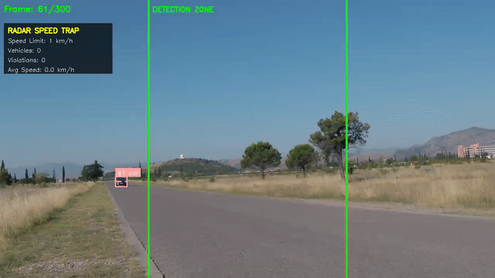
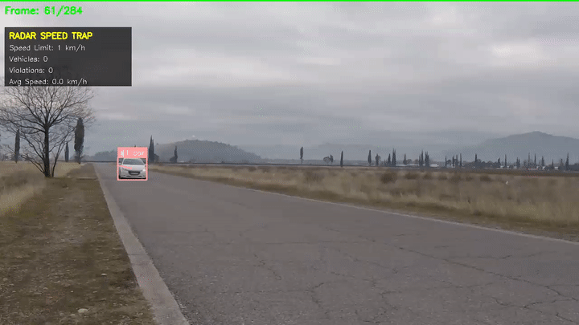

# Vehicle Speed Estimation & License Plate Capture

A computer vision system that estimates vehicle speeds using the line-crossing method and captures license plates for traffic monitoring. Built with YOLOv11 for detection and ByteTrack for multi-object tracking.

## Demo

### Highway (horizontal lines)


### Side View (vertical lines)


### Diagonal (angled lines)


## What It Does

The system works like a virtual speed trap:

1. Two virtual lines are placed across the road (configurable positions)
2. When a vehicle crosses the first line, tracking begins
3. When it crosses the second line, speed is calculated based on travel time
4. If the speed exceeds the limit, a violation is recorded with:
   - Screenshot of the vehicle with bounding box
   - Cropped license plate image
   - OCR-extracted plate text
   - All data logged to CSV

## Why Line-Crossing?

Unlike frame-to-frame displacement methods that require careful camera calibration, line-crossing is:

- **Simple to calibrate** - just measure the real-world distance between two points
- **Robust to perspective** - works regardless of camera angle
- **Accurate** - tested at ±6% average error on ground truth data (35-96 km/h range)

## Quick Demo

```bash
# Clone the repo
git clone https://github.com/Mohamedhendawy312/vehicle-speed-estimation.git
cd vehicle-speed-estimation

# Set up environment
conda create -n cv python=3.10 -y
conda activate cv
pip install -r requirements.txt

# Download models (not included in repo due to size)
# Place yolo11m.pt in the project root
# Place license_plate_detector.pt in models/

# Run using presets (easiest way)
cd src
python -c "
from radar_speed_trap import RadarSpeedTrap

# Use a preset for your camera type
trap = RadarSpeedTrap.from_preset(
    'highway',  # or 'side_view' or 'diagonal'
    model_path='yolo11m.pt',
    lp_model_path='../models/license_plate_detector.pt',
    speed_limit_kmh=80.0,
    output_dir='../data/outputs/my_test'
)
trap.process_video('../path/to/your/video.mp4')
"
```

### Available Presets

| Preset | Camera Type | Lines | Use Case |
|--------|-------------|-------|----------|
| `highway` | Front-facing | Horizontal 50%/77% | Overhead or dashcam view |
| `side_view` | Side-mounted | Vertical 30%/70% | Perpendicular traffic flow |
| `diagonal` | Oblique angle | Diagonal lines | Road receding at angle |

## Installation

### Requirements

- Python 3.8+
- CUDA-capable GPU (recommended for real-time processing)
- Conda (recommended) or pip

### Setup

```bash
# Create environment
conda create -n cv python=3.10
conda activate cv

# Install dependencies
pip install -r requirements.txt

# Optional: install EasyOCR for plate text extraction
pip install easyocr
```

### Models

You'll need two YOLO models:

1. **Vehicle detection** - any YOLOv11 model (yolo11n.pt, yolo11m.pt, etc.)
   - Download from [Ultralytics](https://docs.ultralytics.com/models/yolo11/)
   
2. **License plate detection** - a fine-tuned YOLO model for plates
   - Train your own or find one on [Roboflow](https://universe.roboflow.com/)
   - Place in `models/license_plate_detector.pt`

## Configuration

The main class `RadarSpeedTrap` accepts these parameters:

| Parameter | Default | What it does |
|-----------|---------|--------------|
| `distance_meters` | 10.0 | Real-world distance between the two lines |
| `speed_limit_kmh` | 50.0 | Threshold for violations |
| `line1_percent` | 0.30 | Position of first line (0.0 = top, 1.0 = bottom) |
| `line2_percent` | 0.70 | Position of second line |
| `orientation` | "horizontal" | Line orientation ("horizontal", "vertical", or "custom") |
| `capture_plates` | True | Enable license plate detection |
| `output_dir` | "output" | Where to save results |

### Custom Line Geometry

For diagonal lines or specific positioning:

```python
trap = RadarSpeedTrap(
    line1_points=((0.1, 0.4), (0.9, 0.5)),  # start and end as (x%, y%)
    line2_points=((0.1, 0.7), (0.9, 0.8)),
    distance_meters=20.0
)
```

## Output Structure

```
output_dir/
├── violations.csv           # all violations with timestamps, speeds, plates
├── snapshots/
│   ├── violation_001/
│   │   ├── snapshot.jpg     # full frame with vehicle highlighted
│   │   └── plate.jpg        # cropped license plate
│   ├── violation_002/
│   └── ...
└── annotated_output.mp4     # optional video with overlays
```

### CSV Format

| Column | Description |
|--------|-------------|
| Timestamp | When the violation occurred |
| Track ID | Internal vehicle ID |
| Speed (km/h) | Calculated speed |
| Vehicle Type | car, truck, bus, motorcycle |
| Direction | approaching or receding |
| Plate Text | OCR result (if readable) |
| Snapshot Path | Path to evidence image |
| Plate Path | Path to plate crop |

## Tested On

**VS13 Dataset** - Ground truth vehicle speeds recorded at test track  
Download: [VS13 on Mendeley Data](https://data.mendeley.com/datasets/hwz4gfzy95/)

| Camera | Videos | Speed Range | Avg Error |
|--------|--------|-------------|-----------|
| CitroenC4Picasso (side view) | 10 | 35-96 km/h | ~5% |
| Peugeot208 (diagonal view) | 4 | 40-79 km/h | ~10% |

**Highway Traffic** - Real traffic footage (front-facing camera)  
Source: Stock footage, details withheld

| Metric | Value |
|--------|-------|
| Vehicles detected | 40 |
| Plate detection rate | 72.5% |
| Plate matching accuracy | ~90% |

The main source of plate mismatches is heavy traffic where vehicles overlap and the wrong plate gets captured.

## Project Structure

```
vehicle-speed-estimation/
├── src/
│   ├── radar_speed_trap.py      # main implementation (line-crossing)
│   ├── speed_estimator.py       # basic displacement-based estimator
│   ├── line_crossing_estimator.py
│   ├── robust_speed_estimator.py
│   └── zone_speed_estimator.py
├── models/
│   └── license_plate_detector.pt
├── data/
│   ├── outputs/                 # generated results
│   └── test_data/               # test videos
├── requirements.txt
├── LICENSE
└── README.md
```

## Other Estimators

Besides `RadarSpeedTrap`, the repo includes experimental estimators:

- **speed_estimator.py** - frame-to-frame displacement with smoothing
- **robust_speed_estimator.py** - uses multiple calibration techniques
- **zone_speed_estimator.py** - region-based speed zones
- **sahi_speed_estimator.py** - SAHI for small object detection

These are less polished but might be useful depending on your use case.

## Known Limitations

1. **Occlusion** - when vehicles overlap, plate detection may fail or capture the wrong plate
2. **Camera angle** - steep angles reduce accuracy; overhead or front-facing works best
3. **Low light** - plate OCR degrades significantly in poor lighting
4. **Speed range** - very slow speeds (<10 km/h) have higher relative error

## Tips for Best Results

- Use a stable, fixed camera
- Position lines where vehicles are clearly visible (not at intersections)
- Measure the real distance between lines as accurately as possible
- For highways, use `yolo11m.pt` or larger for better detection at distance
- Adjust `line1_percent` and `line2_percent` based on your camera setup

## Contributing

Feel free to open issues or PRs. Some areas that could use improvement:

- [ ] Add confidence filtering for plate detection
- [ ] Implement plate verification (check if plate bbox is within vehicle bbox)
- [ ] Support for multi-lane counting
- [ ] Better handling of motorcycles (often too small for plate detection)

## License

MIT License - see [LICENSE](LICENSE)

## Author

**Mohamed Hendawy**
- GitHub: [@Mohamedhendawy312](https://github.com/Mohamedhendawy312)
- Email: mohamedhendawy312@gmail.com
